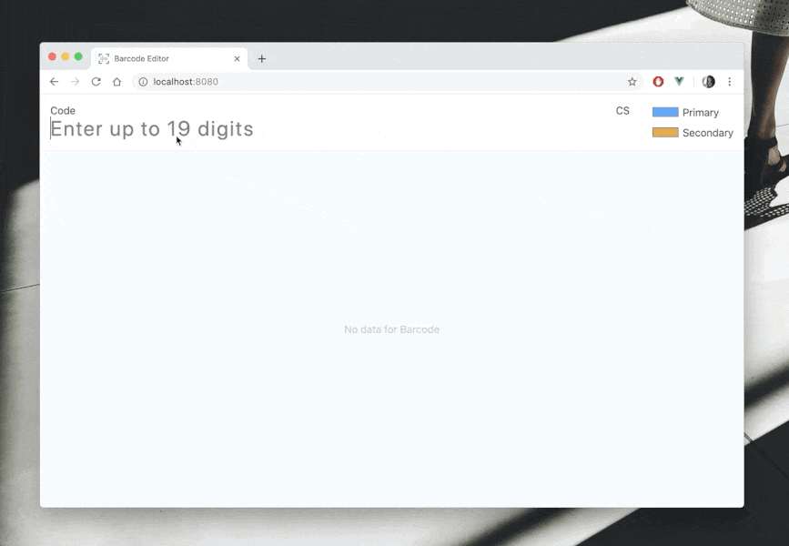

# Barcode editor 
### [Demo](http://vilinicz.com/barcode_editor/)
> Tested only in Chrome desktop!

  
### Summary
- [x] Enter up to 19 digits
- [x] Calculate checksum
- [x] Generate fluid barcode from digits & checksum
- [x] Change colors of barcode

#### Stack used
Default Vue app created with vue-cli. 
Added custom reset and color styles (`src/assets/styles/`) for fast prototyping.  

#### Completed in 3 days total
1) read task and think
2) coding (~6 hours)
3) deploy & readme  
------
### Tech. highlights
#### Checksum calculation
Alternative approach: we also can use loops - less readable but more performant for some cases
```js
checksum() {
  if (!this.code) return null;

  const evenSum = this.digitsArray
    .filter((v, i) => i % 2 !== 0)
    .reduce((a, b) => a + b, 0);
  const oddSum = this.digitsArray
    .filter((v, i) => i % 2 === 0)
    .reduce((a, b) => a + b, 0);

  const remainder = (evenSum + oddSum * 3) % 10;
  return remainder === 0 ? 0 : 10 - remainder;
}
```  
#### Bars' sizing 
Bars are made with `div` blocks sized in percent units. 
Another possible approaches:
- SVG: ~same performance, harder implementation, research needed.
- Canvas: no comments, not in this case.

Universal sizing algorithm still isn't obvious for me, 
so optimal decision in terms *'get this job done'* 
was to check if Digit belongs to specific range with given characteristics.
```js
 barStyle(d) {
   let width;
   let height;

   // Assign width
   if (d < 4) {
     width = 4;
   } else if (d < 8) {
     width = 10;
   } else {
     width = 17;
   }
   
   // Assign height
   if ([0, 4, 8].includes(d)) {
     height = 4;
   } else if ([1, 5, 9].includes(d)) {
     height = 8;
   } else if ([2, 6].includes(d)) {
     height = 12;
   } else {
     height = 16;
   }

   return {
     height: `${height * 5}%`,
     width: `${width}%`,
   };
 }
``` 
### Some possible enhancements
- use Vuex as data storage for more complex interactions;
- move Barcode out from its background for better reusabilty;
- use more global styles or css/ui-frameworks; 
- mobile views / cross browser testing
- moreover: maybe start with Nuxt.js, not just Vue;
- some interface ideas: 
  - we will need sidebar/toolbar with more menus/tools;
  - maybe make Barcode container resizable (smth like `vue-draggable-resizable` plugin)

___
### Project setup
```
npm install
```

#### Compiles and hot-reloads for development
```
npm run serve
```

#### Compiles and minifies for production
```
npm run build
```

#### Run your tests
```
npm run test
```

#### Lints and fixes files
```
npm run lint
```

#### Run your unit tests
```
npm run test:unit
```

#### Customize configuration
See [Configuration Reference](https://cli.vuejs.org/config/).
